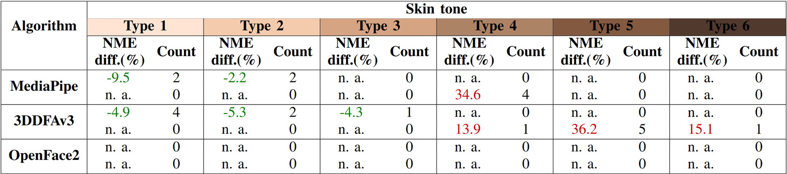

# FAIRSET - INTER 2025
## FAIRSET pour l'évaluation d'IA de détection de repères de visages
-------

|Auteurs|Affiliations|
--------|------------|
|Ian-Mathieu Joly1,3 Nikola Zelovic1,3 Eléonor Riesco2,3 Karina Lebel1,3|1Université de Sherbrooke, Faculté de genie 2Université de Sherbrooke, Faculté des sciences de l'activité physique 3Centre de recherche sur le vieillissement|

 

## Introduction
Plusieurs études ont été effectuées afin d'évaluer l'existence de biais dans les modèles d'intelligence artificielle par apprentissage profond. À cet effet, dans le cas des IA de détection dans des images, la majorité des biais démographiques répertoriés touche le sexe, la teinte de peau et l'âge des individus (Buolamwini, 2018; Hazirbas, 2021; Khalil, 2020; Menezes, 2021). Toutefois, l'existence de ces biais dans les modèles de détection de repères de visages n'est pas connue. Les algorithmes de placement de repères de visage « face landmark detection » (FLD) sont des algorithmes servant à annoter certains points clés sur le visage des différentes personnes dans une image.

    <b>Figure 1)</b> Étapes de détection des repères de visages d'un individu (yang, 2022)

Ces types d'algorithmes sont couramment utilisés dans des contextes de divertissement, mais aussi dans des contextes plus critiques comme des études médicales. Cependant, dans ces tâches plus difficiles, leurs lacunes commencent à être apparentes. Il est bien documenté que des facteurs environnementaux, tels que les occlusions ou le mauvais éclairage, peuvent engendrer une perte de précision. En plus, pour certains algorithmes similaires, un lien significatif a été observé entre la qualité des résultats et certains facteurs démographiques, comme l'âge, le sexe et la teinte de peau. Les algorithmes modernes de FLD sont en fait des réseaux de neurones, dont la source de données d'apprentissage peut grandement influencer les biais des modèles.

Cependant, ces biais en lien avec les démographies n'ont pas été validés pour les algorithmes de « face landmarking ». Alors, à notre connaissance, il n'y a pas de moyens actuels pour déterminer si ce lien existe pour ces algorithmes spécifiques, mais surtout de valider si un algorithme envisagé présente certains biais.

Comme résultat, nous avons développé le jeu de données FAIRSET afin de valider ces biais. FAIRSET est composée de 810 images uniques contenants 866 visages, annotés avec des repères de visage et des données démographiques (sexe, âge et teinte de peau sur l'échelle de Fitzpatrick). FAIRSET est balancé en nombre de visages au niveau du sexe et s'approche d'un équilibre dans la distribution des groupes d'âges. Finalement, FAIRSET se dirige vers une distribution équilibrée de différentes teintes de peau, menant à un « gold standard » dans les jeux de données pour l'évaluation des biais d'IA de détection de repères de visages.

    <b>Figure 2)</b> Étapes de création de FAIRSET

 

    <b>Figure 3) A)</b> Distribution démographique de FAIRSET. <b>B)</b> Repères annotés dans FAIRSET et erreur normalisée entre annotateurs (&bull; ~1mm; &bull; ~3mm; &bull; ~6mm; &bull; ~10mm;
    &bull; 23mm)

Par la suite, nous avons été capables de conduire une analyse statistique afin de valider si les algorithmes de « face landmarking » présentent bel et bien des biais démographiques. Les algorithmes <b>Mediapipe FaceMesh v2</b>, <b>3DDFAv3</b> et <b>OpenFace2</b> ont été choisis pour leur popularité. La métrique utilisée pour cette étude était la NME (Normalized Mean Error), soit l'erreur de placement normalisée par la distance entre les coins externes des yeux de la personne.

    <b>Figure 4)</b> Exemple de calcul NME

Pour débuter, les statistiques descriptives ont été extraites et présentées dans les graphiques ci-dessous.

     

    <b>Figure 5) A)</b> Erreurs NME par IA par teinte de peau <b>B)</b> NME par IA par groupe d'âge <b>C)</b> NME par IA par sexe perçu

De ces résultats, on voit qu'OpenFace2 performe significativement moins bien que les deux autres, ce qui n'est pas surprenant puisqu’il est plus âgé que les deux autres algorithmes. De plus, il est possible d'observer que les médianes sont relativement similaires entre les différentes démographies, mais que la variance varie. Alors, des analyses subséquentes étaient requises pour pousser l'analyse. Une ANOVA pour les facteurs d'âge et de teinte de peau, puis un t-test pour le sexe. Les nombres de points statistiquement affectés (p < 0.05) par les différents facteurs démographiques sont présentés dans le tableau ci-dessous.

    <b>Figure 6)</b> Facteurs affectant la précision des IA

On peut donc voir que pour certains points, pour tous les algorithmes, un lien statistique semble exister entre la démographie des personnes et les résultats. Afin de voir quelles démographies spécifiques impactent les résultats, une analyse post-hoc de Tukey a été conduite pour l'âge et la teinte de peau, puis les résultats du t-test ont été analysés pour le sexe.

    <b>Figure 7) A)</b> Différences de précision entre IA selon la teinte de peau  <b>B)</b> Différence de précision entre IA selon l'âge et le sexe perçu

Les tableaux ci-dessus présentent l'augmentation moyenne de la NME pour les points significativement impactés par le facteur démographique par rapport à la moyenne globale de l'algorithme. En d'autres mots, ils démontrent à quel point les différents groupes démographiques impactent les résultats.

En conclusion, FAIRSET est une première, puisqu'aucun autre jeu de donnée existant ne comporte des annotations de repères de visage en plus d'annotations démographiques portant sur la teinte de peau, l'âge et le sexe. De plus, FAIRSET tend vers un équilibre démographique afin de réduire au maximum les biais d'évaluation. De ce qui est des résultats d'analyse, l'équipe a conclu qu'<b>un lien existe entre les facteurs démographiques de sexe et d'âge, avec une augmentation de l'erreur allant jusqu'à 48 %.</b> Cependant, comme FAIRSET n'est pas complètement balancé dans les différentes teintes de peau et que l'analyse a montré moins de points impactés, des analyses plus poussées sont requises pour tisser un lien définitif pour ce facteur.

Au final, bien que des améliorations puissent effectivement être apportées, <b>FAIRSET propose une voie vers l'obtention d'un standard dans l'évaluation des biais démographiques des IA de détection de repères de visages.</b>